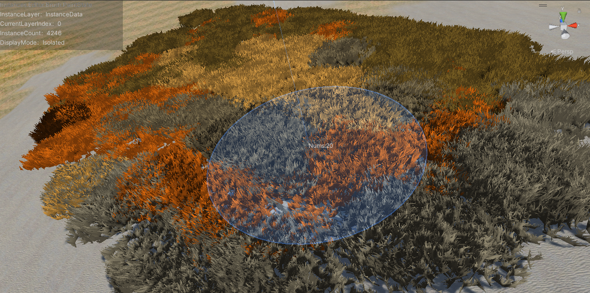
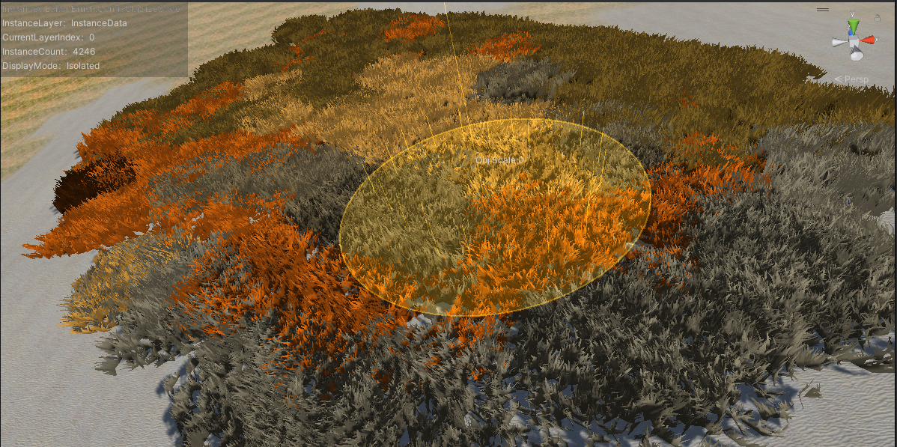
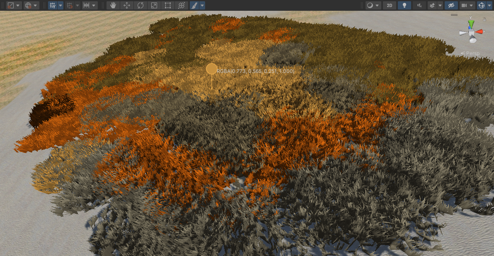
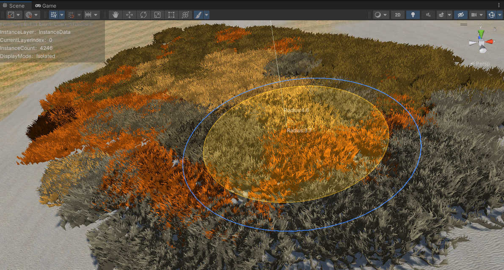
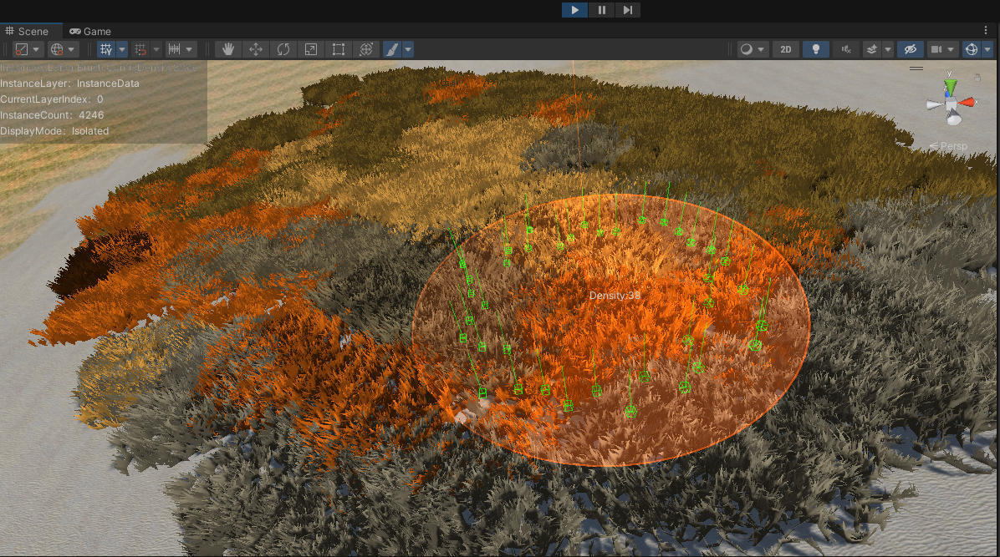
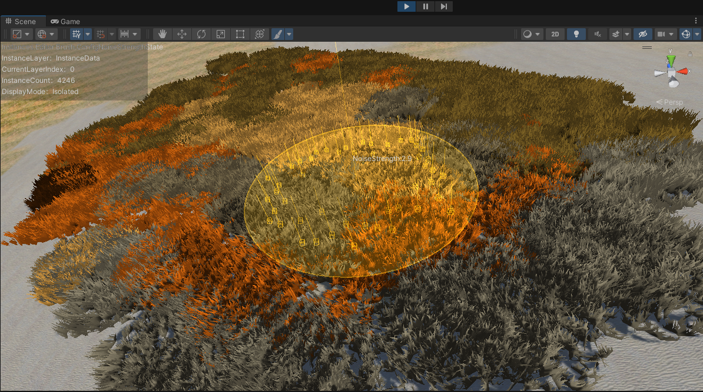

# 实例化笔刷工具 _Instance Brush Tool_



## **概念**

&emsp;&emsp;urp中自定义的渲染批次将笔刷序列化的数据单次提交到命令缓冲区渲染，同时可定义自定义提交数据结构体。

&emsp;&emsp;编辑器工具实例笔刷，拥有多种不同工作模式，可自定义笔刷形状，可自定义笔刷配置列表。笔刷发射射线检测碰撞体来生成对应实例化的数据，例如位置，旋转，缩放，颜色等，这些数据都可以被自定义。

&emsp;&emsp;提供需要对大数量并且变化不大的模型渲染的可编辑工具，合并批处理提高CPU性能，提高画面质量。适用场景，大批量的草或者同类型的植被等。绘制时，投射射线检测碰撞体表面生成绘制点进行绘制，相对的也可以擦除范围内的实例数据。

&emsp;&emsp;笔刷可自定义配置，配置项目会在下面详细说明。

<br> 

## *解决的需求*
&emsp;&emsp;需要一次性渲染多个相同的模型，并且提供可自定义编辑的笔刷。

## *安装*
&emsp;&emsp;将模块直接复制到项目中编译即可，安装目录为项目的直接路径。

&emsp;&emsp;需要的依赖环境
- Unity.Mathemetics 可在unity Packages中安装.
- 需要 Universal RP.可在unity Packages中安装.

## *未来计划*
- 改良序列化后的储存数据大小。
- debug材质入口，改进编辑器property页面。
- 已实现：render feature控制渲染队列。
- 简化编辑流程，减少编辑操作。减少property窗口
- 实现instance视锥体裁剪
- 将urp的pbr实现模板添加到自定义的shader中
- 实现阴影渲染pass


## **第一次启动**

&emsp;&emsp;如果您熟悉使用过Blender3D的建模软件，第一次上手对您来说不成问题。

&emsp;&emsp;**快捷键B**呼出笔刷，笔刷形状可自定义。笔刷绘制数据的中间过程可以自定义修改器。**shift键**按住是橡皮擦擦除模式，松开退出橡皮擦模式。其他调整笔刷的模式下鼠标左键确定，右键取消。

&emsp;&emsp;编辑器显示需要对应的层级，每次呼出笔刷层级的游标会重置为零，第一次启动需要配置编辑器内的显示器，层级实例内容，需要在**EditorData.Brush.InstanceDisplayerLayerInfo.asset**文件中配置内容。

&emsp;&emsp;Layer Mask也需要被配置，否则无法投射射线，笔刷也无法绘制。layer mask需要在**EditorData.Brush.Info.asset**文件中配置。

&emsp;&emsp;笔刷的编辑器UI放置在左上角的位置，会随着需要而更新以上信息。

---
## 系统结构

- 编辑器：笔刷工具。
- 渲染特性：自定义的渲染pass
- 序列化数据：实例被序列化后的文件。
  
---
## 功能
&emsp;系统功能描述。

## 笔刷
#### *笔刷的可配置项目：*
项目  | 值域   |默认值|值类型
---- | ----  |--- |---|
笔刷大小| $[0,25]$ | $5$|_FLOAT_
物体大小| $[0$ $,$ $\infty$ $)$ | $1$|_FLOAT_
法线高度| $[0$ $,$ $\infty$ $)$| $5$|_FLOAT_
笔刷密度| $[0,64]$ | $6$|_INT_
区域密度上限| $\infty$ | $64$|_INT_
噪声强度| $[0,5]$ | $1$|_FLOAT_
噪声权重| $[0,1]$ | $0.5$|_FLOAT_
射线层| $\infty$ | **_default_**|_LAYERMASK_
笔刷绘制间隔| $[0,1]$ | $0.25$|_FLOAT_
笔刷颜色 |$[0,1]$|$(1,1,1,1)$| _COLOR_

- 笔刷的**快捷键**可自定义
- 笔刷每层**最大绘制数量**可自定义
- 笔刷**最大密度**可自定义
- 笔刷的**显示颜色**可自定义

### *笔刷基本功能：*

调整笔刷物体大小模式
调整笔刷颜色
调整大小模式
调整密度模式
调整噪声强度模式

| 热键  | 描述   |
| ----  |----  | 
| _Mouse 0_ |**应用**当前值并退出该调整模式  | 
| _Mouse 1_ | **取消**应用并退出该调整模式  |
| _shift_ | 调整模式下调整值变化率**减缓**  |

|  功能   | 热键  | 描述   |
|  ----  | ----  |----  | 
| 绘制  | _b_ |绘制实例化数据  | 
| 调整大小模式  | _f_ | 调整**笔刷大小** |
| 调整噪声权重模式  | _d_ | 调整噪声对笔刷影响的**权重**  |
| 调整笔刷颜色  | _s_ | 吸取屏幕中的颜色作为**笔刷颜色**  |
| 橡皮擦  | _shift_ | **擦除**笔刷形状内的实例化数据 |
| 调整密度模式  | _shift + f_| 调整**物体密度**  |
| 调整噪声强度模式  | _shift + d_ | 调整笔刷**噪声强度**  |
| 调整笔刷物体大小模式  | _shift + S_| 调整**实例大小**  |
| 层级调整上 | _page up_| 调整**实例层级**上翻页  |
| 层级调整下 | _page down_| 调整**实例层级**下翻页  |
| 聚焦到鼠标指定位置 | _g_| 场景视角聚焦到**鼠标位置**  |

---

## 实例数据

### *可配置项目*

项目   |默认值|值类型
---- | -- |---|
实例数据文件|$null$|_**InstanceDatas**_

项目   |默认值|值类型
---- | -- |---|
材质|$null$|_**MATERIAL**_
模型|$null$|_**MESH**_

---

<br>

## 数据结构
#### &emsp;&emsp;提供的实例数据结构如下：

|名字|含义|类型|长度
|---|---|---|---|
|Position|位置|矢量|$4*3$
|Rotation|旋转|四元数|$4*4$
|localScale|局部大小|矢量|$4*3$
|Color|颜色|颜色RGBA|$4*4$

数据长度计算结果：$4*3+4*4+4*3+4*4$  $=$ $56$ _byte_ $/$ **_instance_**
<br>

### 数据储存位置
项目|文件路径|性质
---|---|---|
笔刷自定义配置|../Assets/EditorResources/EditorData.Brush.Profile.assets|*编辑器*
笔刷配置|../Assets/EditorResources/EditorData.Brush.Info.asset|*编辑器*
编辑器显示器层级匹配|../Assets/EditorResources/EditorData.Brush.InstanceDisplayerLayerInfo.asset|*编辑器*
实例化层级配置文件|../Assets/**_Resources_**/Instances/Instance.xxxLayer.asset|**运行时**

---

## *Shader*

&emsp;&emsp;若要显示实例化的数据shader中需要声明数据结构*sturcturedbuffer*，并且需要支持GPU instancing，并且材质选项中需要勾选*gpu instancing*。所以有案例如下：

- 在URP中需要引用URP库
- 声明编译器指令*instancing*
- 实现*buffer*的数据结构并且声明
- 在*vertex shader*中声明*SV_INSTANCEID*的语义
- 所有在shader中的pass都需要用到instanceid

```
HLSLINCLUDE

#pragma vertex vert
#pragma fragment frag

#pragma multi_compile_instancing
#include "Packages/com.unity.render-pipelines.universal/ShaderLibrary/Core.hlsl"
#include "Lib/quaternion.hlsl"

struct InstanceInfo
{
    float3 position;
    float4 rotation;
    float3 localscale;
    float4 color;
};

StructuredBuffer<InstanceInfo> _Infosbuffer;

struct appdata
{
    float4 vertex : POSITION;
    float2 uv : TEXCOORD0;
    float3 normal   : NORMAL;
    uint instanceID :SV_INSTANCEID;
};

struct v2f
{
    UNITY_VERTEX_INPUT_INSTANCE_ID
    float4 vertex : SV_POSITION;
    float4 color : TEXCOORD0;
};

HLSLEND
```

```
HLSLPROGRAM

v2f vert(appdata v){
    v2f o;
    UNITY_SETUP_INSTANCE_ID(v);
    UNITY_TRANSFER_INSTANCE_ID(v,o);

    InstanceInfo data = _Infosbuffer[v.instanceID];
    
    float3 objectpos = v.vertex.xyz;
    objectpos = objectpos * data.localscale;
    objectpos = quat_apply(objectpos.xyz,data.rotation);
    objectpos = objectpos + data.position;

    v.vertex.xyz = objectpos.xyz;

    o.vertex = mul(UNITY_MATRIX_MVP, v.vertex);
    o.color = data.color;

    return o;
}
half4 frag (v2f i) : SV_Target
{
    UNITY_SETUP_INSTANCE_ID(i)
    return 0;
}

HLSLEND
```

## 模型*MESH*
&emsp;&emsp;当选择模型网格时尽量选择模型原点在世界原点上方的模型，原因是笔刷绘制是通过投射射线将物体放置在射线结果的法线表面。

&emsp;&emsp;如果模型有多个*subMesh*（多维子材质）渲染中只会采用第一个*submesh*.

## 材质*Material*
&emsp;&emsp;材质选项中需要把材质的**GPU INSTANCING**打开，否则将无法显示结果并且弹出错误。

&emsp;&emsp;材质使用的shader也必须支持**GPU INSTANCING**

---

## 美术资源制作技巧

&emsp;&emsp;使用blender创作模型时，如果是草面片的样式，可以使用blender中的曲线工具绘制一些曲线，让曲线的位置在$xoz$平面中投影结果像是一片草地，再通过赋予曲线材质更改颜色。最后放置一个正交摄像机朝向$xoz$平面，渲染拍摄出结果，保存图片作为草面片的贴图。

&emsp;&emsp;完成制作草面片贴图之后，再次在blender中创作成群的草面片模型，并且赋予草贴图的材质，需要链接透明通道，再做一些形变让其群体更加自然，最后完成结果导出到游戏引擎中使用。

> 创作的案例文件：..\BlenderArt\Grass